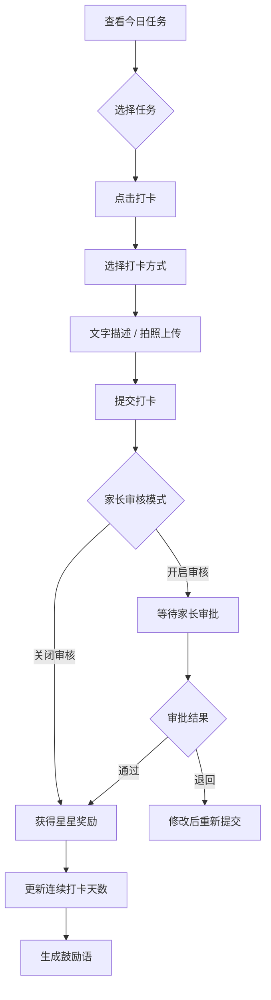
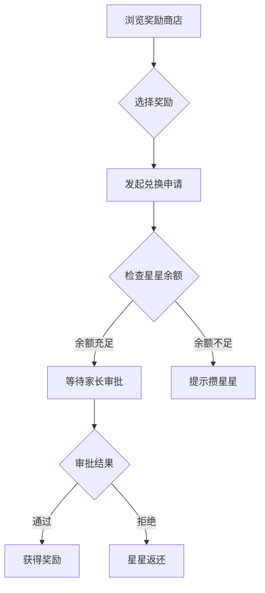

# 小星星成长记 - 儿童习惯养成 App 产品需求文档

## 1. 产品概述

一款专为6-12岁儿童和家长共同设计的习惯养成移动应用，通过趣味化的任务打卡、星星奖励系统和丰富的社交互动，帮助孩子养成早睡、阅读、运动等良好习惯，同时增进亲子关系。

产品面向注重孩子习惯培养的中国家庭，采用温暖友善的视觉风格，让孩子在快乐中成长进步。

## 2. 核心功能

### 2.1 用户角色

| 角色 | 注册方式 | 核心权限 |
|------|---------|---------|
| 家长 | 手机号注册，创建家庭 | 创建任务、管理奖励、审批打卡、设置系统参数 |
| 孩子 | 通过家长邀请码加入 | 查看任务、打卡、兑换奖励、查看成长记录 |

### 2.2 功能模块

#### 2.2.1 孩子任务页
- **任务卡片展示**：以可爱的卡片形式展示今日任务
- **习惯类型**：早睡早起、阅读、运动、家务、学习等
- **重复周期设置**：每日、工作日、周末、自定义
- **提醒时间**：家长设置的提醒时间推送
- **打卡流程**：选择文字描述或拍照上传完成打卡
- **任务状态**：待完成、待审核、已完成、被打回

#### 2.2.2 奖励商店
- **自定义奖励**：家长创建奖励项目和所需星星数量
- **奖励类型**：玩具、游玩、特权、游戏时间等
- **兑换申请**：孩子发起兑换申请，家长审批
- **历史记录**：查看兑换历史

#### 2.2.3 家长设置
- **任务管理**：创建、编辑、删除习惯任务
- **奖励管理**：添加、修改奖励项目和兑换规则
- **系统设置**：提醒时间、审核模式、关键规则锁定
- **规则控制**：限制孩子修改关键规则（如任务完成标准）

#### 2.2.4 成长记录
- **周报**：展示本周任务完成情况、连续打卡天数、获得星星数
- **月报**：展示本月统计数据和进步曲线
- **成就徽章**：完成特定里程碑获得徽章
- **情绪记录**：孩子可以记录当天心情的小贴纸

#### 2.2.5 家庭成员
- **成员管理**：添加多个孩子账户
- **邀请码**：生成邀请码供孩子加入
- **临时挑战**：设置有时间限制的特殊任务
- **鼓励语生成**：根据任务完成情况自动生成鼓励语
- **成员信息**：头像、昵称、星星余额显示

## 3. 核心流程

### 3.1 任务打卡流程

### 3.2 奖励兑换流程

## 4. 用户界面设计

### 4.1 设计风格
- **整体风格**：温暖可爱的卡通风格，色彩明快但不刺眼
- **主色调**：温暖的橙色和黄色，象征阳光和活力
- **辅助色**：清新的蓝色、绿色，分别用于任务和成就
- **强调色**：金色用于星星和重要奖励
- **字体**：圆润易读的手写风格字体
- **图标风格**：可爱简洁的扁平化图标，带有圆润边角
- **布局风格**：卡片式布局，大按钮易点击，适合儿童操作

### 4.2 页面设计

#### 首页（孩子任务页）
- **顶部**：家庭成员头像切换、星星余额显示
- **中间**：今日任务卡片列表，支持滑动切换
- **任务卡片**：可爱图标 + 任务名称 + 进度 + 打卡按钮
- **底部**：导航栏（任务、商店、成长、成员）

#### 奖励商店页
- **顶部**：搜索栏和分类筛选
- **中间**：奖励卡片网格展示
- **奖励卡片**：图片 + 名称 + 所需星星数 + 立即兑换按钮

#### 成长记录页
- **顶部**：周报/月报切换标签
- **中间**：数据统计图表（环形图、柱状图）
- **底部**：成就徽章墙和情绪记录区

#### 家庭成员页
- **顶部**：家庭头像和家庭名称
- **成员列表**：所有成员卡片（头像、昵称、角色）
- **功能区**：添加成员、临时挑战、鼓励语设置

#### 家长设置页
- **分区**：任务管理、奖励管理、系统设置
- **操作按钮**：大尺寸易操作
- **规则锁定开关**：清晰标识哪些规则孩子无法修改

### 4.3 移动端适配
- 移动优先设计，触摸目标最小48px
- 底部固定导航栏，方便单手操作
- 支持横屏和竖屏模式
- 动画效果流畅，不影响性能
- 支持深色模式

### 4.4 特殊交互
- **鼓励语气泡**：完成任务后弹出可爱的鼓励语
- **星星飞行动画**：获得星星时的视觉反馈
- **情绪贴纸**：可拖拽的心情贴纸选择器
- **连续打卡动画**：庆祝连续打卡里程碑的动画效果

## 5. 数据统计维度

### 5.1 孩子端数据
- 今日任务完成率
- 连续打卡天数
- 本周/本月获得星星总数
- 已兑换奖励数量
- 情绪记录趋势

### 5.2 家长端数据
- 各任务完成率统计
- 家庭成员贡献排行榜
- 奖励发放统计
- 周报/月报导出

## 6. 产品亮点

- **趣味化设计**：可爱的视觉风格和丰富的动画效果
- **亲子互动**：家长全程参与审核和设置
- **正向激励**：连续打卡机制和成就系统
- **情绪关怀**：情绪记录功能关注孩子心理
- **规则保护**：家长可锁定关键规则，防止孩子随意修改
- **数据可视化**：直观的成长报告帮助家长了解孩子进步
