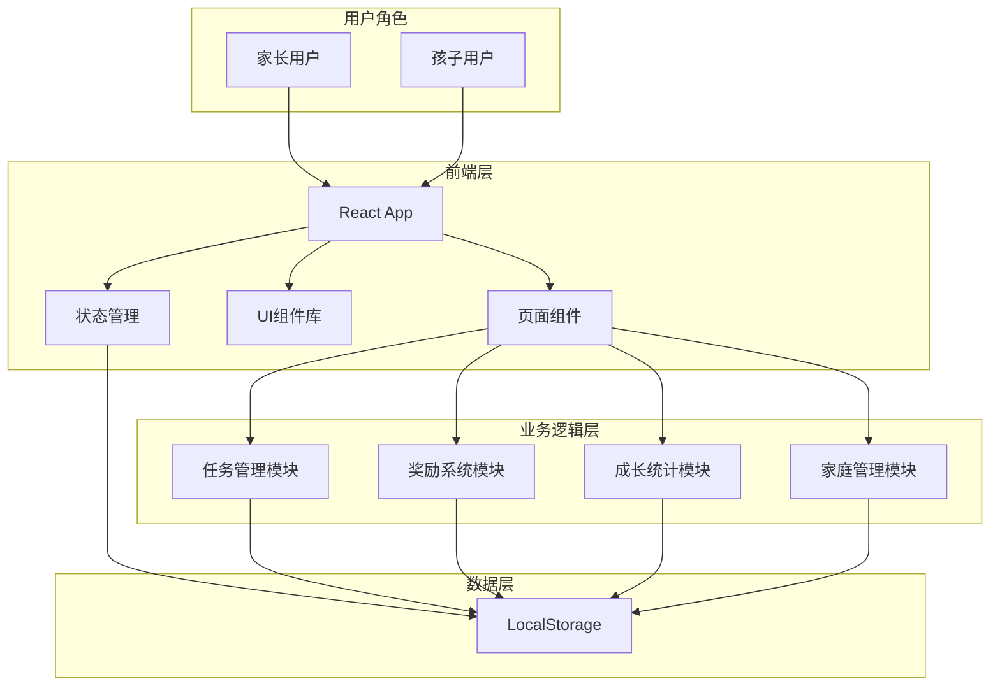

# 小星星成长记 - 技术架构文档

## 1. 架构设计

### 1.1 技术栈选择

**前端框架**：React 18 + TypeScript + Vite
**样式方案**：Tailwind CSS 3 + 自定义CSS变量
**状态管理**：React Context + useReducer
**路由管理**：React Router v6
**数据持久化**：LocalStorage（模拟本地存储）
**图标库**：Lucide React（轻量、可爱风格）
**动画方案**：CSS动画 + Framer Motion（用于复杂动画）

**架构模式**：组件化架构
- `/src/components/` - 可复用UI组件
- `/src/pages/` - 页面组件
- `/src/context/` - 全局状态管理
- `/src/hooks/` - 自定义Hooks
- `/src/utils/` - 工具函数
- `/src/types/` - TypeScript类型定义
- `/src/data/` - 模拟数据

### 1.2 系统架构图



## 2. 路由定义

| 路由 | 页面名称 | 权限要求 | 功能描述 |
|------|---------|---------|---------|
| `/` | 登录/首页 | 公开 | 角色选择、登录入口 |
| `/child/tasks` | 孩子任务页 | 孩子 | 查看和打卡任务 |
| `/child/shop` | 奖励商店 | 孩子 | 浏览和兑换奖励 |
| `/child/growth` | 成长记录 | 孩子 | 查看周报月报 |
| `/child/family` | 家庭成员 | 孩子 | 家庭互动 |
| `/parent/tasks` | 任务管理 | 家长 | 创建编辑任务 |
| `/parent/rewards` | 奖励管理 | 家长 | 管理奖励项目 |
| `/parent/settings` | 系统设置 | 家长 | 系统参数配置 |
| `/parent/approve` | 审批中心 | 家长 | 审批打卡和兑换 |

## 3. 数据模型

### 3.1 用户模型

```typescript
interface User {
  id: string;
  name: string;
  avatar: string;
  role: 'parent' | 'child';
  familyId: string;
  stars: number;
  createdAt: string;
}
```

### 3.2 任务模型

```typescript
interface Task {
  id: string;
  name: string;
  icon: string;
  description: string;
  repeatType: 'daily' | 'weekdays' | 'weekends' | 'custom';
  repeatDays?: number[];
  reminderTime: string;
  starReward: number;
  requireApproval: boolean;
  requirePhoto: boolean;
  assignedTo: string[];
  isActive: boolean;
  createdBy: string;
}
```

### 3.3 打卡记录模型

```typescript
interface CheckIn {
  id: string;
  taskId: string;
  userId: string;
  content: string;
  photo?: string;
  status: 'pending' | 'approved' | 'rejected';
  starsEarned: number;
  checkInDate: string;
  approvedBy?: string;
  approvedAt?: string;
}
```

### 3.4 奖励模型

```typescript
interface Reward {
  id: string;
  name: string;
  description: string;
  image: string;
  starCost: number;
  isActive: boolean;
  createdBy: string;
}
```

### 3.5 兑换记录模型

```typescript
interface Redemption {
  id: string;
  rewardId: string;
  userId: string;
  status: 'pending' | 'approved' | 'rejected';
  starsSpent: number;
  createdAt: string;
  processedBy?: string;
  processedAt?: string;
}
```

### 3.6 情绪记录模型

```typescript
interface MoodRecord {
  id: string;
  userId: string;
  mood: 'happy' | 'excited' | 'neutral' | 'sad' | 'angry';
  note?: string;
  date: string;
}
```

## 4. 核心功能实现

### 4.1 任务打卡系统

**功能流程**：
1. 展示当日任务列表（根据重复周期筛选）
2. 点击任务进入打卡页面
3. 选择文字描述或拍照上传
4. 提交后根据 requireApproval 决定是否直接完成
5. 需要审核时，状态为 pending
6. 家长审批后更新状态和星星

**连续打卡逻辑**：
- 每日任务：按日期连续性计算
- 打卡中断则重置连续天数
- 特殊节日可设置豁免

### 4.2 星星奖励系统

**获得星星**：
- 完成任务基础奖励：1-5颗星
- 连续打卡额外奖励：每7天额外+1颗星
- 家长额外奖励：手动发放

**消耗星星**：
- 兑换奖励商店物品
- 兑换时锁定星星
- 审批拒绝时返还

### 4.3 成长报告生成

**周报内容**：
- 本周任务完成率
- 连续打卡天数变化
- 获得星星总数
- 情绪变化趋势
- 进步最大的任务

**月报内容**：
- 月度完成率统计
- 任务对比分析
- 成就徽章展示
- 综合成长建议

### 4.4 鼓励语生成

**规则**：
- 根据任务类型匹配鼓励语模板
- 结合连续打卡天数增加鼓励强度
- 支持自定义鼓励语配置
- 失败时提供安慰和鼓励

**示例**：
- 首次完成：「太棒了！你迈出了好习惯的第一步！」
- 连续7天：「太厉害了！连续一周都在坚持，你真是个小冠军！」
- 获得额外奖励：「额外的星星奖励！你的努力爸爸妈妈都看到了！」

### 4.5 规则锁定机制

**家长可锁定项**：
- 任务完成标准（是否需要审核）
- 奖励兑换规则
- 星星汇率
- 家庭成员管理权限

**孩子可操作项**：
- 打卡提交
- 奖励浏览和申请
- 情绪记录
- 查看自己的成长报告

## 5. 组件库设计

### 5.1 基础组件

| 组件名 | 说明 | 状态 |
|--------|------|------|
| Button | 圆角按钮，支持多种变体 | default, hover, active, disabled |
| Card | 任务卡片、奖励卡片 | default, selected, completed |
| Input | 文字输入框 | default, focus, error, disabled |
| Avatar | 用户头像展示 | online, offline |
| Badge | 星星徽章、成就徽章 | various types |
| Modal | 弹窗组件 | open, close |
| Toast | 操作反馈提示 | success, error, info |
| Tab | 标签页切换 | active, inactive |
| Progress | 进度条/环形图 | percentage |

### 5.2 业务组件

| 组件名 | 说明 |
|--------|------|
| TaskCard | 任务卡片（含状态、操作按钮） |
| RewardCard | 奖励卡片（含价格标签） |
| StarCounter | 星星数量展示动画 |
| MoodPicker | 情绪选择器（5种表情） |
| EncouragementBubble | 鼓励语气泡 |
| WeeklyChart | 周报数据图表 |
| MemberList | 家庭成员列表 |
| ApprovalCard | 待审批项目卡片 |

## 6. 性能优化

### 6.1 加载优化
- 路由懒加载
- 图片按需加载
- 组件代码分割

### 6.2 渲染优化
- React.memo 优化列表渲染
- useMemo/useCallback 减少重复计算
- 虚拟列表处理长列表

### 6.3 动画优化
- CSS动画优先
- will-change 优化
- 60fps流畅度保证

## 7. 数据持久化策略

### 7.1 LocalStorage 结构
```
{
  "family": { ... },
  "users": [...],
  "tasks": [...],
  "checkIns": [...],
  "rewards": [...],
  "redemptions": [...],
  "moodRecords": [...],
  "settings": { ... }
}
```

### 7.2 数据初始化
- 首次访问时初始化默认数据结构
- 提供示例数据供用户体验
- 支持数据导入导出

## 8. 安全考虑

### 8.1 权限控制
- 家长端和儿童端路由隔离
- 关键操作需二次确认
- 家长可查看所有数据，儿童仅看自己数据

### 8.2 规则保护
- 规则锁定后前端校验
- LocalStorage 操作记录审计
- 家长可查看操作日志

## 9. 扩展性设计

### 9.1 主题系统
- 支持主题切换（默认、节日限定）
- CSS变量统一管理颜色
- 组件样式可覆盖

### 9.2 国际化
- 中英文语言包分离
- 日期格式化本地化
- 数字格式化本地化

### 9.3 数据迁移
- 支持导出JSON格式数据
- 提供数据导入接口
- 版本升级自动迁移
